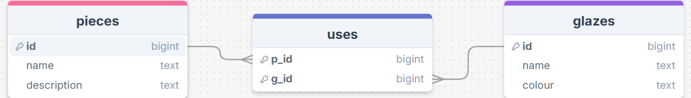
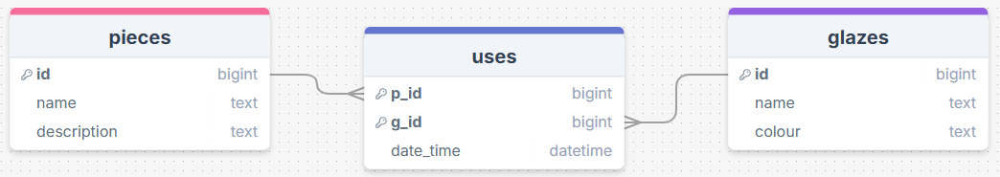

# Sprint 1 - A Working UI Prototype

## Sprint Goals

Develop a prototype that simulates the key functionality of the system, then test and refine it so that it can serve as the model for the next phase of development in Sprint 2.

[Figma](https://www.figma.com/) is used to develop the prototype.

---

## Initial Database Design

My database has a many to many relationship using the 'uses' table as a middle man 

---

## UI 'Flow'

The first stage of prototyping was to explore how the UI might 'flow' between states, based on the required functionality.

This Figma demo shows the initial design for the UI 'flow':

<iframe style="border: 1px solid rgba(0, 0, 0, 0.1);" width="450" height="800" src="https://embed.figma.com/proto/jrjTF0v4YJQb6mhxI8gtz6/Untitled?node-id=42-2769&p=f&scaling=scale-down&content-scaling=fixed&page-id=0%3A1&starting-point-node-id=42%3A2769&embed-host=share" allowfullscreen></iframe>

### Testing

Giving my prototype to my end-user this was some feedback that was raised: 
> There is no way to cancel adding a piece or glaze so maybe add a cancel button or home button somewhere

> Photo of the piece before and after being glazed

> Date of when piece was started/completed 

### Changes / Improvements

After my end-user gave me feedback on places i could work on, i added a cancel button as well as a home button, a space fro pictures to be displayed next to the 
pieces in the list and added a field for my end-user to add the date. 

<iframe style="border: 1px solid rgba(0, 0, 0, 0.1);" width="450" height="800" src="https://embed.figma.com/proto/ZRpIf2Z5lhSrrTPOOyWl4G/V2?node-id=1-444&p=f&scaling=scale-down&content-scaling=fixed&page-id=0%3A1&embed-host=share" allowfullscreen></iframe>

---

## Improved Database Design

After the talks with my end-user, their comment about having the date of when the piece was added to the database required me to change
my drawSQL prototype. 

---

### Testing

Giving my V2 prototype to my end-user this was some feedback that was raised: 
> Increase the amount of glazes that can be added to 7 or so 

> Add the total amount of layers done 

### Changes / Improvements

I made the glazes box into a dropdown that should create another one below it when filled in so that more glazes can be added. I also made another box in the "add piece" form that allows my end-user to add the total amount of planned glazes for the piece. 

---

## Refined UI Prototype

<iframe style="border: 1px solid rgba(0, 0, 0, 0.1);" width="450" height="800" src="https://embed.figma.com/proto/h1WEgzJ1t517FIH7K2vcqM/V3?node-id=1-443&p=f&scaling=min-zoom&content-scaling=fixed&page-id=0%3A1&embed-host=share" allowfullscreen></iframe>

---     

## Sprint Review

Completing my design with feedback and additions from my end-user I can be sure that the finished product will pretty much satisfy their wants/needs. Some small changes are sure to be needed as my end-user may change their mind about the color etc. Getting my prototype to be easy to use and not have silly ways to get to pages was a key success point and should mean I have less work to do in the next sprint. 

