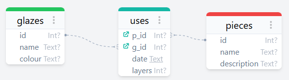
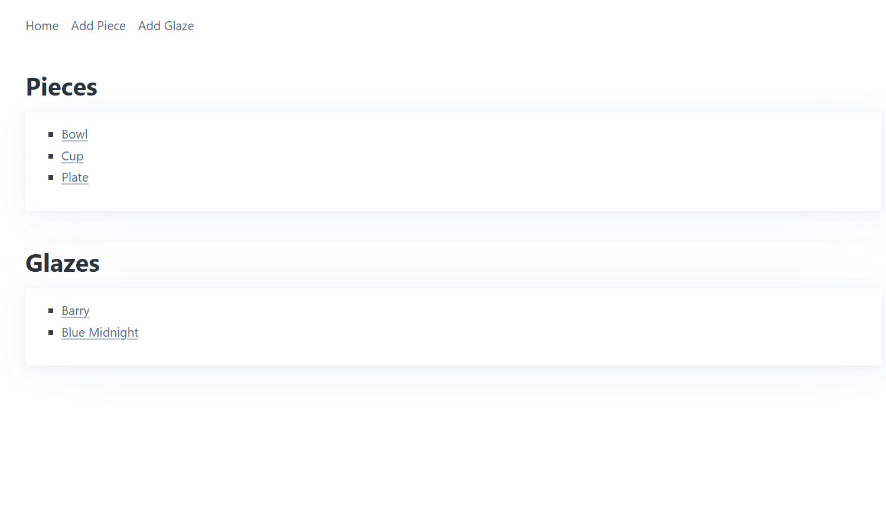
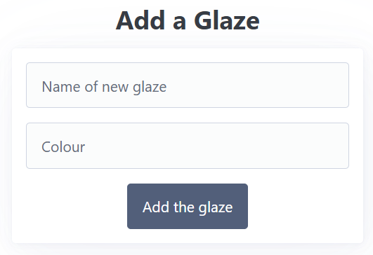
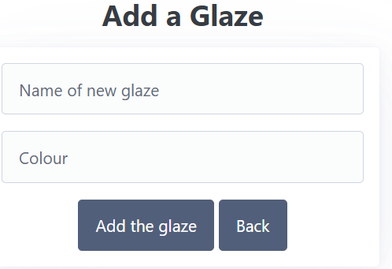

# Sprint 2 - A Minimum Viable Product (MVP)

## Sprint Goals

Develop a bare-bones, working web application that provides the key functionality of the system, then test and refine it so that it can serve as the basis for the final phase of development in Sprint 3.

---

## Implemented Database Schema

Slight chances were made to my database schema compared to the planned version. This was the fact that the time stamp was no longer needed so I removed it. 

---

## Initial Implementation

The key functionality of the web app was implemented:

---

## Back Button

My end-user made the suggestion that my add glaze/piece pages should also include a back button if they accidentally press on them. 

## Refined UI Prototype

### Changes / Improvements

Added a back button.

## Sprint Review

Replace this text with a statement about how the sprint has moved the project forward - key success point, any things that didn't go so well, etc.

Surprisingly, my end-user didn't have a lot to say during this sprint. They liked the way they could use my webpage and only had the suggestion of a back button, something I stupidly overlooked. All their input during the prototype phase has meant little changes were needed here.
