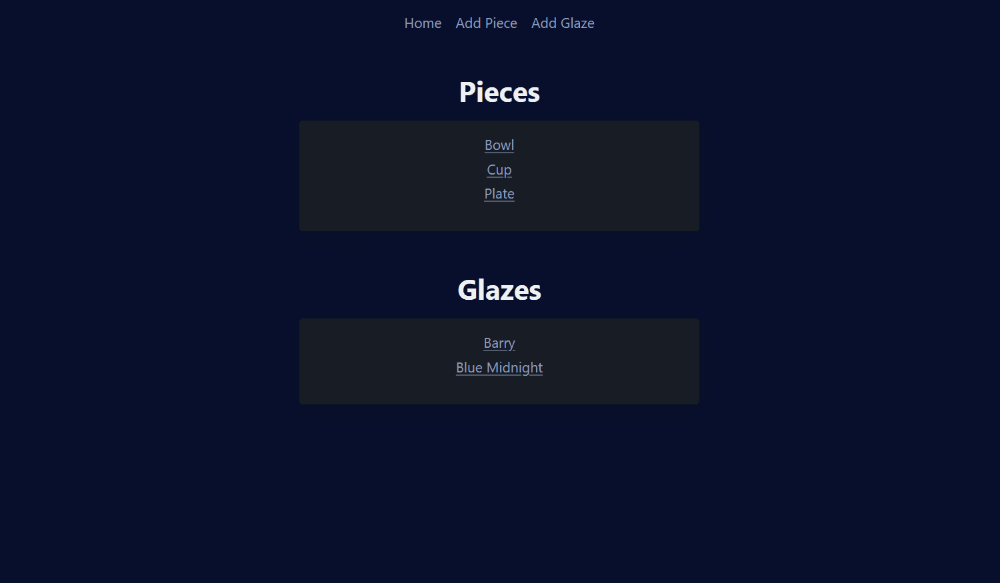
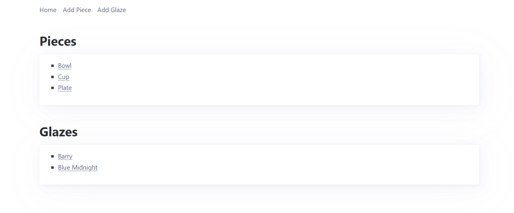
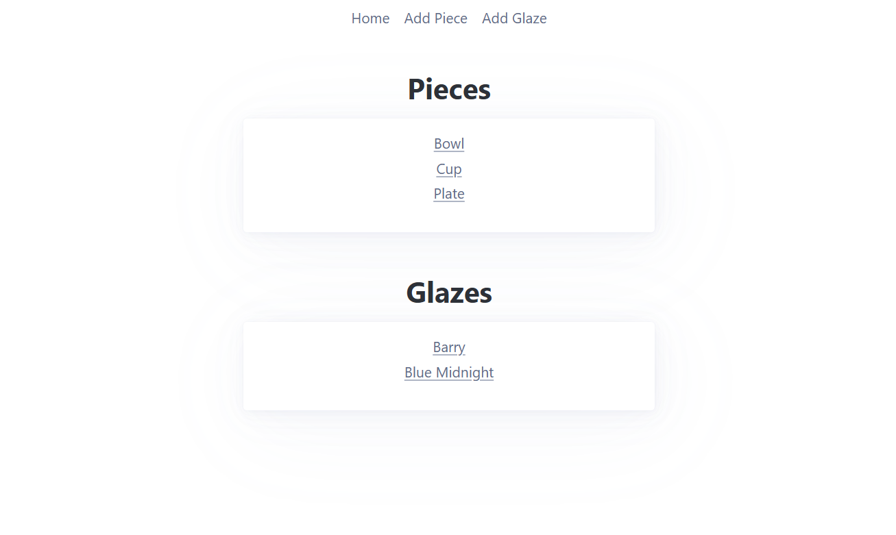
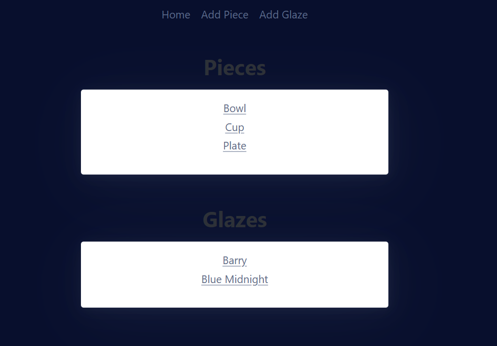
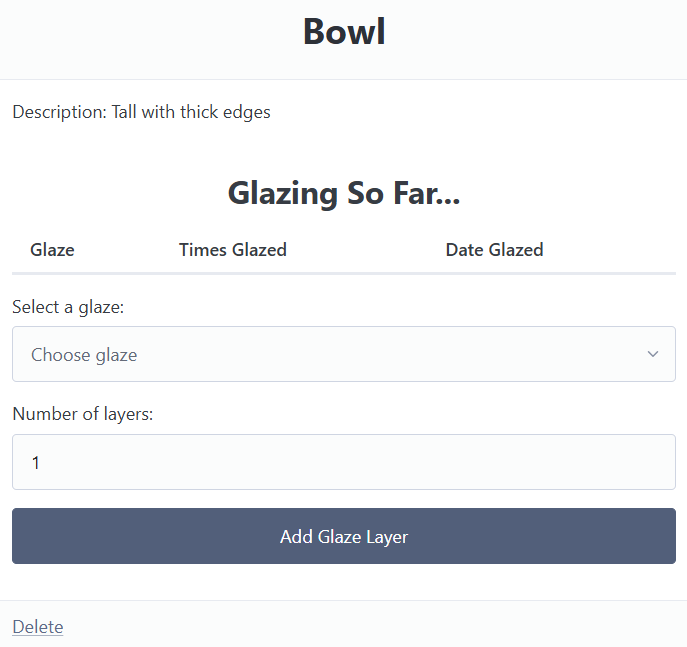
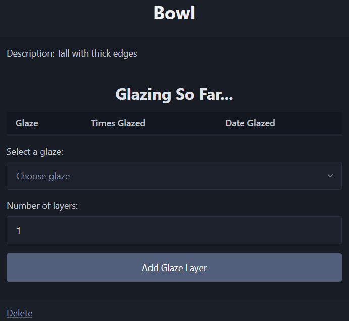

# Sprint 3 - A Refined and Complete System

## Sprint Goals

Develop the system until it is fully featured, with a refined UI and it satisfies the requirements. The system will be fully tested at this point.

---

## Final Implementation

The web app is fully implemented with a refined UI:

Here's a basic run through of it. 

---

## Centering 

The webpage looked "weird" with the lists being on the left side, leaving the right side bare. 

### Changes / Improvements

Moving the lists and the nav to be centre aligned made the webpage look fuller. Additionally, I removed the bullet-points from the list to give it a simpler look as they were "unnecessary" 

---

## Background Colour

Replace this text with notes about what you are testing, how you tested it, and the outcome of the testing

The default background colour is a very bright white, this makes it "hard to look at". So I changed it. 

### Changes / Improvements

Changing it to this dark blue made the webpage much easier on the eyes and made the articles much more visible.

---

## Dark vs Light Theme 

My end-user mentioned that the light theme made the webpage hard to look at and hurt their eyes slightly. To combat this I made the suggestion of dark mode. 

### Changes / Improvements

This change made the table easier to look at by reducing the unrelenting bright white. 

---

## Sprint Review

The project is now seemingly complete, everything works and is displayed nicely how my end-user wants. 

